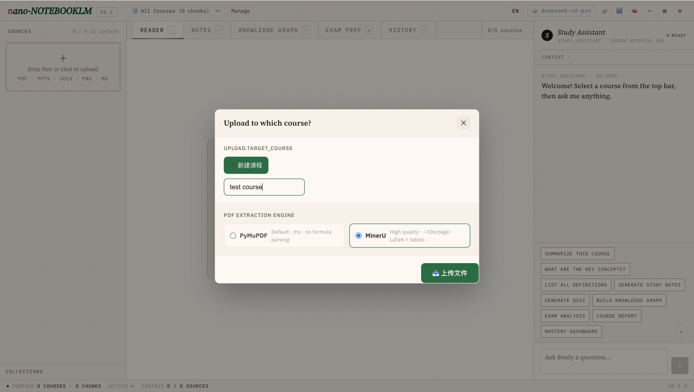
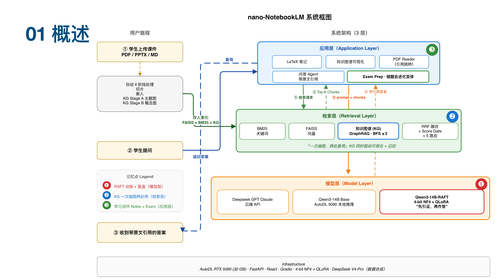

<div align="center">

# nano-NotebookLM

**A self-hosted, open-source study assistant — chat with citations, structured LaTeX notes, exam-prep with a self-evolving question bank, and an editable knowledge graph.**

[](LICENSE)
[](https://www.python.org/downloads/)
[](https://github.com/ArthurYangX/nano-NotebookLM/actions/workflows/test.yml)
[](https://github.com/psf/black)
[](CONTRIBUTING.md)

English | [简体中文](README.zh-CN.md)

<sub>Not affiliated with Google. NotebookLM is a trademark of Google LLC.</sub>

<video src="https://github.com/ArthurYangX/nano-NotebookLM/releases/download/v0.2.0/hero.mp4"
       poster="docs/screenshots/hero.png"
       width="900" autoplay loop muted playsinline controls>
  
</video>

</div>

---

Upload course PDFs / PPTX / DOCX / Markdown → automatic knowledge graph
+ vector index → chat with **page-accurate citations**, structured
LaTeX notes, practice quizzes, exam prep with a **self-evolving question
bank**, and an editable mind map.

Bring your own model: **OpenAI · DeepSeek · Moonshot · Zhipu · MiniMax
· Groq · Together · Anthropic Claude · Gemini**, or any local runner
that speaks OpenAI's `/v1/chat/completions` (**Ollama / vLLM / LM Studio
/ llama.cpp**).

```bash
git clone https://github.com/ArthurYangX/nano-NotebookLM && cd nano-NotebookLM
python -m venv .venv && source .venv/bin/activate && pip install -e ".[test]"
cp .env.example .env && $EDITOR .env   # set at least one LLM key
python api/server.py                   # → http://localhost:8000
```

> Looking for architecture and code map? See [`CLAUDE.md`](CLAUDE.md).
> Want to contribute? See [`CONTRIBUTING.md`](CONTRIBUTING.md).

---

## Why nano-NotebookLM

| Capability                                | nano-NotebookLM   | Google NotebookLM | ChatGPT (upload PDF) |
|-------------------------------------------|:-----------------:|:-----------------:|:--------------------:|
| Fully self-hosted, your data never leaves | ✅                | ❌                | ❌                   |
| Bring your own LLM (cloud or local)       | ✅ 9+ providers   | ❌ Gemini only    | ❌ OpenAI only       |
| **Page-accurate citations**, click to jump | ✅               | ✅                | ⚠️ inline quote only |
| Editable knowledge graph                  | ✅                | ❌                | ❌                   |
| LaTeX notes (KaTeX + tectonic PDF)        | ✅                | ❌                | ❌                   |
| Exam prep with self-evolving question bank | ✅               | ❌                | ❌                   |
| Background upload pipeline, resumable     | ✅                | ✅                | ⚠️ session-bound     |
| Cross-course retrieval                    | ✅                | ❌                | ❌                   |
| Cost at scale                             | Local GPU / API   | Free tier capped  | Subscription         |

---

## Features

- **Chat with page-accurate citations** — RAG (BM25 + FAISS + RRF) +
  knowledge-graph retriever (concept-cosine seed + BFS hop expansion).
  Every answer links back to the source page in the built-in PDF reader.
- **LaTeX notes** — per-source-file streaming generation with a global
  review pass. KaTeX in the browser; optional `tectonic` compile to PDF.
- **Practice quizzes + Exam Prep** — generates questions, grades them,
  and **auto-generates variants of the ones you got wrong** so the bank
  grows in the directions you actually need.
- **Editable knowledge graph** — d3-force layout with relation filters,
  double-click edit, shift-drag to connect, `N` to add child, `Del` to
  remove. Edits persist as an overlay so re-extraction never clobbers
  your work.
- **Reader** — built-in PDF / PPTX preview, click any citation chip in a
  chat answer or note to jump to the exact page.
- **Background upload pipeline** — close the tab and come back; the
  ingest job keeps running.

### See it in action

<table>
<tr>
<td width="50%" valign="top">
  
  <br><b>LaTeX Notes</b> — per-file streaming generation, KaTeX preview, click any citation chip to jump to the source page.
</td>
<td width="50%" valign="top">
  
  <br><b>Knowledge Graph</b> — d3-force layout with relation filters (part-of / depends-on / related / example-of). Edit overlay survives re-extraction.
</td>
</tr>
<tr>
<td width="50%" valign="top">
  
  <br><b>Exam Prep</b> — topics weighted by mastery; wrong answers auto-spawn variant questions so the bank grows where you need it.
</td>
<td width="50%" valign="top">
  
  <br><b>Upload pipeline</b> — pick the PDF engine per-course (PyMuPDF for speed, MinerU for scanned). Runs in the background, resumable.
</td>
</tr>
</table>

---

## Architecture

<div align="center">



*Three layers: Application (Notes / KG / Reader / QA / Exam Prep) →
Retrieval (BM25 + FAISS + GraphRAG + RRF) → Model (OpenAI / DeepSeek /
Claude cloud APIs, or any local 7B–14B served via Ollama / vLLM).*

</div>

Single-process, single-machine, no auth, no DB — designed for one user
or a small team running it on their own laptop / workstation.

---

## Quick Start

```bash
# 1. clone + install
git clone https://github.com/ArthurYangX/nano-NotebookLM && cd nano-NotebookLM
python -m venv .venv && source .venv/bin/activate
pip install -e ".[test]"

# 2. configure at least one LLM backend
cp .env.example .env
$EDITOR .env                  # set OPENAI_API_KEY (or ANTHROPIC_API_KEY, or LOCAL_LLM_*)

# 3. run
python api/server.py          # → http://localhost:8000
```

Open the browser, click **Upload your first document**, drop in a PDF, and you're
done.

### Test the install

```bash
pytest                         # unit + API smoke tests; no LLM keys required
```

---

## Provider matrix

| Provider              | Type             | `OPENAI_BASE_URL`                                              | Suggested model                              |
|-----------------------|------------------|----------------------------------------------------------------|----------------------------------------------|
| OpenAI                | Cloud, native    | `https://api.openai.com/v1`                                    | `gpt-4o-mini`                                |
| Anthropic Claude      | Cloud, native    | *(uses Anthropic SDK)*                                         | `claude-sonnet-4-5`                          |
| DeepSeek              | Cloud, compat    | `https://api.deepseek.com/v1`                                  | `deepseek-chat`                              |
| Moonshot              | Cloud, compat    | `https://api.moonshot.cn/v1`                                   | `moonshot-v1-8k`                             |
| Zhipu GLM             | Cloud, compat    | `https://open.bigmodel.cn/api/paas/v4`                         | `glm-4-flash`                                |
| MiniMax               | Cloud, compat    | `https://api.minimax.chat/v1`                                  | `abab6.5-chat`                               |
| Groq                  | Cloud, compat    | `https://api.groq.com/openai/v1`                               | `llama-3.3-70b-versatile`                    |
| Together              | Cloud, compat    | `https://api.together.xyz/v1`                                  | `meta-llama/Llama-3.3-70B-Instruct-Turbo`    |
| Gemini (OpenAI mode)  | Cloud, compat    | `https://generativelanguage.googleapis.com/v1beta/openai/`     | `gemini-2.0-flash`                           |
| **Ollama**            | Local            | `http://localhost:11434/v1`                                    | `qwen2.5:7b`                                 |
| **vLLM**              | Local            | `http://localhost:8000/v1`                                     | `Qwen/Qwen2.5-7B-Instruct`                   |
| **LM Studio**         | Local            | `http://localhost:1234/v1`                                     | *(model loaded in LM Studio)*                |
| **llama.cpp server**  | Local            | `http://localhost:8080/v1`                                     | *(GGUF model loaded)*                        |

You can mix freely — add a cloud OpenAI key for high-quality KG
extraction, point chat at a local 7B for privacy, and the Settings UI
swaps between them per-task without restart.

### Editing providers from the UI (no restart)

`.env` is **just the first-boot seed**. On first start the server
synthesises `artifacts/providers.json` from your env vars and from then
on the Settings page is the source of truth: add a second
OpenAI-compatible endpoint, swap a model, set the active default, or
one-click **Test → 5s ping** — all without restarting. Keys can stay in
`.env` (`api_key_ref: env:VAR`) or be stored inline if you prefer
(`api_key_ref: literal:sk-…`; written 0o600, never echoed in any
response).

| Endpoint                                    | Purpose                              |
|---------------------------------------------|--------------------------------------|
| `GET    /api/providers`                     | List configured providers (redacted) |
| `PUT    /api/providers/{id}`                | Create or update                     |
| `DELETE /api/providers/{id}`                | Remove (refuses default / last row)  |
| `POST   /api/providers/{id}/test`           | 5-token ping with 5s timeout         |
| `POST   /api/providers/default`             | Switch active default                |

---

## Embeddings

Three switchable presets, picked from the Settings UI (no restart, no
destructive rebuild — each preset gets its own FAISS namespace under
`indices/faiss/<preset>/`, so toggling is a path-route):

| Preset         | Model                                            | Notes                                       |
|----------------|--------------------------------------------------|---------------------------------------------|
| `local_mini`   | `paraphrase-multilingual-MiniLM-L12-v2`          | Offline, 50+ languages, CJK-friendly (default) |
| `openai_large` | `text-embedding-3-large`                         | Best cross-lingual quality, costs money     |
| `bge_m3`       | `BAAI/bge-m3`                                    | Strong CJK + EN, runs locally (heavier)     |

The first switch to a never-used preset kicks off a one-shot background
rebuild of every course's index; the banner in the topbar tracks
progress. Switching back to an already-built preset is instant.

The env vars in `.env.example` (`EMBEDDING_MODE` / `EMBEDDING_MODEL` /
`EMBEDDING_API_*`) only seed the first-run default — once the Settings
preset is set, it wins.

---

## Main API endpoints

| Endpoint                                    | Purpose                                                                     |
|---------------------------------------------|-----------------------------------------------------------------------------|
| `POST /api/chat`                            | RAG + KG retrieval chat with citations and intent routing.                  |
| `POST /api/agent/stream`                    | Multi-turn tool-calling agent (NDJSON stream).                              |
| `POST /api/notes/full-course/stream`        | Per-file LaTeX note generation with review pass; incremental cache.         |
| `POST /api/quiz`                            | Practice quiz generation.                                                   |
| `POST /api/exam-prep/*`                     | Topic planning, question seeding, quiz draw, submit + auto-variant.         |
| `GET/POST /api/mindmap/{course_id}`         | Knowledge graph read; student edit ops.                                     |
| `POST /api/upload/{course_id}`              | Upload files; returns `{task_id, course_id}` immediately.                   |
| `GET  /api/upload/status/{task_id}`         | Poll background ingest progress (resume on tab reopen).                     |
| `GET  /api/status`                          | Configured backends, embedding mode, version, latency p50.                  |

Example:

```bash
curl -X POST http://localhost:8000/api/chat \
  -H "Content-Type: application/json" \
  -d '{"question": "What is a receptive field?", "course_id": null, "backend": "openai-main"}'
```

`backend` is optional — set it to any provider id from
`GET /api/providers` (e.g. `"openai-main"`, `"claude-main"`, or a
user-added `"openai-alt"`) to override the default routing for a single
call. Unknown ids fall back to the active default with a server-side
warn log, so a stale localStorage chip value won't 422 mid-conversation.

---

## Project layout

```
api/server.py            FastAPI entry point
frontend/                React 18 (CDN, no build), served statically
nano_notebooklm/
  ├── ai/                LLM router + openai/claude/local backends
  ├── ingest/            PDF/PPTX/DOCX extractors + chunking
  ├── kb/                FAISS + BM25 + RRF hybrid + graph search
  ├── kg/                Two-stage knowledge graph extraction
  ├── skills/            QA, notes, quiz, exam-prep, report, mastery
  └── orchestrator/      Skill routing, multi-turn agent loop, memory
scripts/                 ingest + index + embedding helpers
tests/                   pytest suite — runs offline, no LLM keys needed
artifacts/               (gitignored) per-course chunks, indices, KG, notes
docs/screenshots/        README assets
```

---

## Development

```bash
pip install -e ".[test]"
pytest                         # unit + API smoke
pytest tests/test_api_smoke.py # quick subset
```

The frontend has no build step — it's React via the CDN and Babel
standalone. Just edit a `.jsx` file and refresh the browser.

See [`CONTRIBUTING.md`](CONTRIBUTING.md) for the contributor checklist
and [`CLAUDE.md`](CLAUDE.md) for the code-map / conventions.

---

## Roadmap

Recently shipped:

- Background upload pipeline with NDJSON stage events
- UI-managed provider matrix (add / swap / test without restart)
- Three-tier embedding presets (local MiniLM / OpenAI 3-large / BGE-M3)
- MinerU OCR ingest for scanned PDFs
- Multi-turn chat with history-aware query rewriting
- Selection-driven notes generation (per-file checkbox, incremental cache)
- Central i18n table (`frontend/i18n.js`) — full zh + en UI parity

Planned (issues welcome):

- Vite build option (opt-in, CDN stays default)
- Mastery-driven exam-prep difficulty curve
- Cross-course graph linking
- Docker Compose one-liner

---

## Production notes

nano-NotebookLM is designed for **single-user / small-team self-hosting**.
There is no authentication, no rate limiting, no multi-tenant isolation,
and no persistent task queue. If you expose it on the public internet:

- Put it behind a reverse proxy with HTTP basic auth (or OAuth).
- Disable `force=true` regen endpoints externally — they call the LLM
  on demand without per-IP throttling.
- Move `artifacts/` to a persistent volume.

---

## License

[MIT](LICENSE) — do what you want, just keep the copyright notice.

## Acknowledgements

- Inspired by Google's [NotebookLM](https://notebooklm.google.com/).
  **Not affiliated with Google.** NotebookLM is a trademark of Google LLC.
- Naming convention follows [`nanoGPT`](https://github.com/karpathy/nanoGPT)
  and [`nano-vLLM`](https://github.com/GeeeekExplorer/nano-vllm) —
  small, self-hosted, single-file-friendly homages.
- Knowledge graph layout: [d3-force](https://github.com/d3/d3-force).
- PDF rendering: [PyMuPDF](https://pymupdf.readthedocs.io/) for
  extraction, [PDF.js](https://mozilla.github.io/pdf.js/) in the browser.
  LaTeX → PDF via [tectonic](https://tectonic-typesetting.github.io/).
- Embeddings: [sentence-transformers](https://www.sbert.net/),
  multilingual MiniLM-L12-v2 default.
- OCR for scanned PDFs: [MinerU](https://github.com/opendatalab/MinerU).
