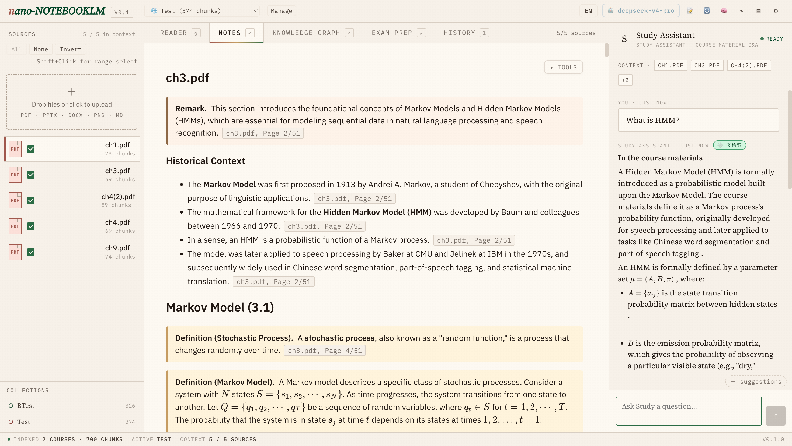
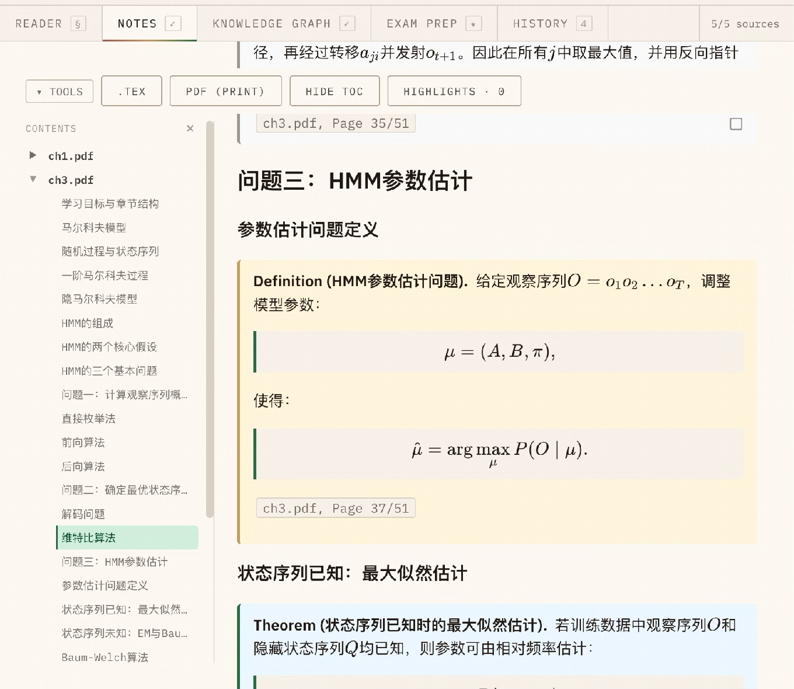
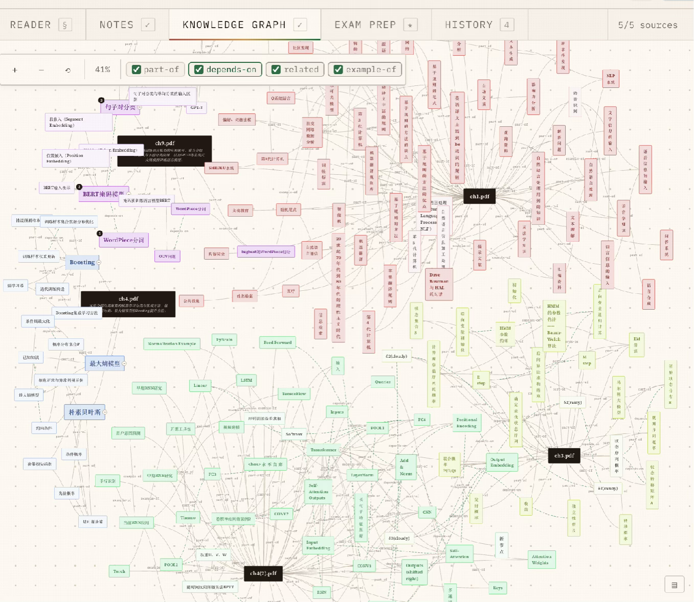
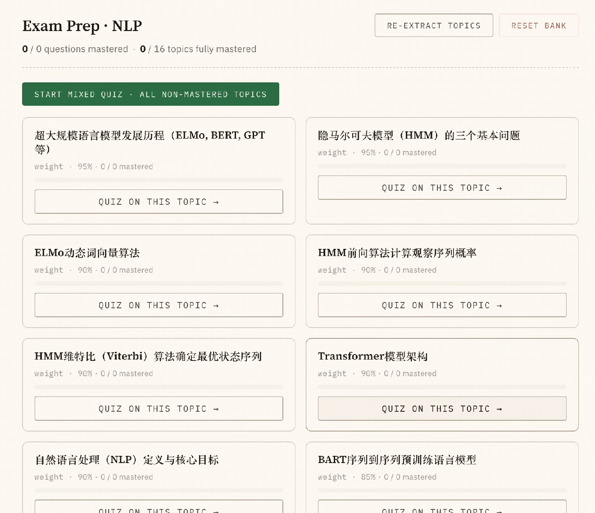
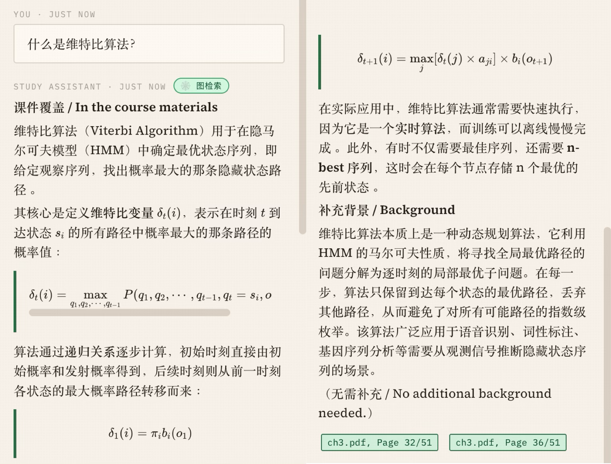

<div align="center">

# nano-NotebookLM

**一个自托管、开源的学习助手 —— 带原文引用的对话、结构化 LaTeX 笔记、错题自演化的考试复习题库、可编辑的知识图谱。**

[](LICENSE)
[](https://www.python.org/downloads/)
[](https://github.com/ArthurYangX/nano-NotebookLM/actions/workflows/test.yml)
[](https://github.com/psf/black)
[](CONTRIBUTING.md)

[English](README.md) | 简体中文

<sub>本项目与 Google 无关。NotebookLM 是 Google LLC 的商标。</sub>

<video src="https://github.com/ArthurYangX/nano-NotebookLM/releases/download/v0.2.0/hero.mp4"
       poster="docs/screenshots/hero.png"
       width="900" autoplay loop muted playsinline controls>
  
</video>

</div>

---

## 概况

上传课程 PDF / PPTX / DOCX / Markdown → 自动构建知识图谱 + 向量索引 →
带**页级精确引用**的对话、结构化 LaTeX 笔记、练习题、带**错题自演化题库**
的考试复习模式、以及可编辑的思维导图。

自带模型即可使用：**OpenAI · DeepSeek · Moonshot · 智谱 · MiniMax ·
Groq · Together · Anthropic Claude · Gemini**，以及任何兼容 OpenAI
`/v1/chat/completions` 协议的本地推理后端（**Ollama / vLLM /
LM Studio / llama.cpp**）。

---

## 快速开始

```bash
# 1. 克隆 + 安装（uv 比 pip 快约 10×，两个都行）
git clone https://github.com/ArthurYangX/nano-NotebookLM && cd nano-NotebookLM
uv venv && source .venv/bin/activate && uv pip install -e ".[test]"
# 或：python -m venv .venv && source .venv/bin/activate && pip install -e ".[test]"

# 2. 配置 —— 复制模板，至少填一个 LLM key
#    （OPENAI_API_KEY、或 ANTHROPIC_API_KEY、或 LOCAL_LLM_BASE_URL + LOCAL_LLM_MODEL）
cp .env.example .env

# 3. 启动（Ctrl-C 停服；或者用下面的 ./dev.sh 让它后台跑）
python api/server.py
```

### → 在浏览器打开 [`http://localhost:8000`](http://localhost:8000)

然后点顶栏右上角的 **⚙ 设置** 齿轮图标，进入 Settings 管理 LLM
provider —— 新增 / 切换 provider、改默认、或者按 **Test** 做 5 秒连通性
ping，全都不用重启服务。`.env` 里填的 key 是首次启动时的种子；Settings
建好之后，UI 就是唯一可信源（改动写入 `artifacts/providers.json`）。

---

想让服务在后台跑、有 pid / 日志管理？`./dev.sh` 封装了同样的命令：

```bash
./dev.sh install   # 建 .venv + 装依赖 + 复制 .env
./dev.sh up        # 后台启动 + 等 /api/health
./dev.sh status    # pid + /api/status 概览
./dev.sh logs      # tail /tmp/nano-nlm.log
./dev.sh down      # 停服
```

> 装 `uv`（一行命令、比 pip 快约 10×）：
> `curl -LsSf https://astral.sh/uv/install.sh | sh` —— 完整文档见
> <https://docs.astral.sh/uv/getting-started/installation/>。
> 不装也行，原生 `pip` 跑起来完全一样。

#### 可选 extras（按需安装）

| 用途 | 安装命令 | 不装会怎样 |
|---|---|---|
| **MinerU** —— 扫描版 PDF / 公式版幻灯片的 OCR + 版式解析 | `uv pip install -e ".[mineru]"`（重，含模型约 3-5GB） | 上传选 `engine=mineru` 会报错；默认的 `engine=pymupdf` 仍可用 |
| **tectonic** —— LaTeX → PDF（笔记导出） | `brew install tectonic` / `apt install tectonic` | 「导出 PDF」按钮自动隐藏，浏览器内 KaTeX 预览不受影响 |
| **LibreOffice** (`soffice`) —— `.pptx` → PDF sidecar（MinerU 走 pptx 用） | `brew install --cask libreoffice` / `apt install libreoffice` | `.pptx` + `engine=mineru` 静默回落 python-pptx（无 OCR） |

GPU：Linux 下 MinerU 会自动检测 CUDA（1–2 秒/页）；Apple Silicon 默认
走 CPU（约 12 秒/页）—— 自动检测不会选 MPS，因为 pipeline 后端在 MPS
上会 hang。可用 `MINERU_DEVICE_MODE=cuda|cpu|mps` 在 `.env` 里强制覆盖。
**逃生口**：如果 CUDA 被检测出但运行时坏（驱动旧 / 显存满），显式设
`MINERU_DEVICE_MODE=cpu` 让 MinerU 退回 CPU。

> **联网要求。** 前端走 CDN 加载 React / KaTeX / d3-force / CodeMirror /
> IBM Plex 字体（jsdelivr、unpkg、esm.sh、Google Fonts）—— 首次加载页面
> 需要联网。完全离线部署需要把这些资产本地 vendor 一份。

> 想了解架构和代码地图？看 [`CLAUDE.md`](CLAUDE.md)。
> 想贡献代码？看 [`CONTRIBUTING.md`](CONTRIBUTING.md)。

---

## 为什么选 nano-NotebookLM

| 能力                                         | nano-NotebookLM   | Google NotebookLM | ChatGPT（上传 PDF） |
|----------------------------------------------|:-----------------:|:-----------------:|:--------------------:|
| 完全自托管，数据不出本机                       | ✅                | ❌                | ❌                   |
| 自带模型（云端或本地任选）                     | ✅ 9+ provider    | ❌ 仅 Gemini      | ❌ 仅 OpenAI         |
| **页级精确引用**，点击跳转原文                 | ✅                | ✅                | ⚠️ 只能内联引用      |
| 可编辑的知识图谱                              | ✅                | ❌                | ❌                   |
| LaTeX 笔记（KaTeX + tectonic PDF）            | ✅                | ❌                | ❌                   |
| 错题自演化的考试复习题库                       | ✅                | ❌                | ❌                   |
| 后台上传管线，可断点续传                       | ✅                | ✅                | ⚠️ 绑定会话          |
| 跨课程检索                                    | ✅                | ❌                | ❌                   |
| 规模化成本                                    | 本地 GPU / API    | 免费额度有上限     | 订阅制               |

---

## 功能特性

- **带页级引用的对话** —— RAG（BM25 + FAISS + RRF）+ 知识图谱检索器
  （概念余弦做种子 + BFS 跳跃扩展）。每条回答都能跳回内置 PDF 阅读器
  里的原文页面。
- **LaTeX 笔记** —— 按源文件流式生成，全局 review 校对。浏览器内
  KaTeX 渲染；可选 `tectonic` 编译为 PDF。
- **练习题 + 考试复习** —— 自动生成题目、判分，并且**会针对做错的题
  自动生成变体**，让题库往你薄弱的方向生长。
- **可编辑知识图谱** —— d3-force 力导向布局，支持关系筛选、双击编辑、
  shift+拖拽连线、按 `N` 添加子节点、`Del` 删除。编辑以 overlay 持久化，
  重新抽取知识图谱时不会覆盖你的修改。
- **阅读器** —— 内置 PDF / PPTX 预览，点击聊天回答或笔记中的引用块
  即可跳转到精确页面。
- **后台上传管线** —— 关掉标签页再回来照样继续，ingest 任务在后台运行。

### 功能展示

<table>
<tr>
<td width="50%" valign="top">
  
  <br><b>LaTeX 笔记</b> —— 按文件流式生成，KaTeX 实时渲染，点击引用 chip 跳回原文页面。
</td>
<td width="50%" valign="top">
  
  <br><b>知识图谱</b> —— d3-force 力导向布局，支持关系筛选（part-of / depends-on / related / example-of），用户编辑以 overlay 持久化，不会被重新抽取覆盖。
</td>
</tr>
<tr>
<td width="50%" valign="top">
  
  <br><b>考试复习</b> —— 主题按 mastery 权重排序，错题自动生成变体，题库向薄弱方向生长。
</td>
<td width="50%" valign="top">
  
  <br><b>带源文件引用的对话</b> —— 每条回答末尾都带 <code>ch3.pdf, Page 32/51</code> 这样的引用 chip，明确指向原始文件和页码，点击即跳转。中英文分段（课件覆盖 / 补充背景）让「来自你课件的内容」和「补充的背景知识」一目了然。
</td>
</tr>
</table>

---

## Provider 列表

| Provider              | 类型             | `OPENAI_BASE_URL`                                              | 建议模型                                      |
|-----------------------|------------------|----------------------------------------------------------------|----------------------------------------------|
| OpenAI                | 云端，原生       | `https://api.openai.com/v1`                                    | `gpt-4o-mini`                                |
| Anthropic Claude      | 云端，原生       | *（走 Anthropic SDK）*                                          | `claude-sonnet-4-5`                          |
| DeepSeek              | 云端，OpenAI 兼容 | `https://api.deepseek.com/v1`                                  | `deepseek-chat`                              |
| Moonshot              | 云端，OpenAI 兼容 | `https://api.moonshot.cn/v1`                                   | `moonshot-v1-8k`                             |
| 智谱 GLM              | 云端，OpenAI 兼容 | `https://open.bigmodel.cn/api/paas/v4`                         | `glm-4-flash`                                |
| MiniMax               | 云端，OpenAI 兼容 | `https://api.minimax.chat/v1`                                  | `abab6.5-chat`                               |
| Groq                  | 云端，OpenAI 兼容 | `https://api.groq.com/openai/v1`                               | `llama-3.3-70b-versatile`                    |
| Together              | 云端，OpenAI 兼容 | `https://api.together.xyz/v1`                                  | `meta-llama/Llama-3.3-70B-Instruct-Turbo`    |
| Gemini（OpenAI 兼容）  | 云端，OpenAI 兼容 | `https://generativelanguage.googleapis.com/v1beta/openai/`     | `gemini-2.0-flash`                           |
| **Ollama**            | 本地             | `http://localhost:11434/v1`                                    | `qwen2.5:7b`                                 |
| **vLLM**              | 本地             | `http://localhost:8001/v1` *（挑个空闲端口；**别用 8000**，那是 app server）* | `Qwen/Qwen2.5-7B-Instruct`                   |
| **LM Studio**         | 本地             | `http://localhost:1234/v1`                                     | *（在 LM Studio 里加载的模型）*               |
| **llama.cpp server**  | 本地             | `http://localhost:8080/v1`                                     | *（加载的 GGUF 模型）*                        |

可以自由混搭 —— 加一个云端 OpenAI key 跑高质量知识图谱抽取，对话切到
本地 7B 保护隐私，设置页随时按任务粒度切换，无需重启。

### 在 UI 里编辑 provider（无需重启）

`.env` **只是首次启动时的种子**。首次启动时服务端会用环境变量生成
`artifacts/providers.json`，之后这个文件就是唯一可信源：在设置页加一个
新的 OpenAI 兼容端点、换模型、切默认 provider、或者一键
**Test → 5 秒 ping** —— 全都不用重启。Key 可以保留在 `.env` 里
（`api_key_ref: env:VAR`），也可以直接存到文件里
（`api_key_ref: literal:sk-…`；权限 0o600 写盘，任何 API 响应都不会
回显原文）。

| 接口                                        | 用途                                  |
|---------------------------------------------|---------------------------------------|
| `GET    /api/providers`                     | 列出所有 provider（已脱敏）           |
| `PUT    /api/providers/{id}`                | 新建或更新                            |
| `DELETE /api/providers/{id}`                | 删除（默认或最后一条会拒绝）          |
| `POST   /api/providers/{id}/test`           | 5 token ping，5 秒超时                |
| `POST   /api/providers/default`             | 切换默认 provider                     |

---

## 嵌入模型（Embeddings）

三档可切换 preset，从设置页直接选（无需重启、不破坏旧索引 ——
每个 preset 在 `indices/faiss/<preset>/` 下有独立 namespace，
切换就是改路由）：

| Preset         | 模型                                              | 备注                                       |
|----------------|---------------------------------------------------|--------------------------------------------|
| `local_mini`   | `paraphrase-multilingual-MiniLM-L12-v2`           | 离线，50+ 语言，中文友好（默认）            |
| `openai_large` | `text-embedding-3-large`                          | 跨语言质量最好，要花钱                      |
| `bge_m3`       | `BAAI/bge-m3`                                     | 中英都强，本地跑（更重）                    |

首次切到从未用过的 preset 会触发后台一次性全量重建，顶栏 banner 会
显示进度。切回已建过的 preset 是瞬时的。

`.env.example` 里的环境变量（`EMBEDDING_MODE` / `EMBEDDING_MODEL` /
`EMBEDDING_API_*`）只是首次启动的种子值 —— 设置页选过 preset 之后，
preset 优先。

---

## 主要 API 接口

| 接口                                        | 用途                                                                          |
|---------------------------------------------|-------------------------------------------------------------------------------|
| `POST /api/chat`                            | RAG + 知识图谱检索 + 引用 + 意图路由的对话                                     |
| `POST /api/agent/stream`                    | 多轮工具调用 agent（NDJSON 流）                                                |
| `POST /api/notes/full-course/stream`        | 按文件流式生成 LaTeX 笔记 + review 校对；增量缓存                              |
| `POST /api/quiz`                            | 练习题生成                                                                    |
| `POST /api/exam-prep/*`                     | 主题规划、初始出题、抽题、提交 + 自动生成变体                                  |
| `GET/POST /api/mindmap/{course_id}`         | 读取知识图谱；学生端编辑操作                                                  |
| `POST /api/upload/{course_id}`              | 上传文件；立刻返回 `{task_id, course_id}`                                     |
| `GET  /api/upload/status/{task_id}`         | 轮询后台 ingest 进度（重新打开标签页可断点续报）                              |
| `GET  /api/status`                          | 已配置的 backend、嵌入模式、版本号、p50 延迟                                  |

示例：

```bash
curl -X POST http://localhost:8000/api/chat \
  -H "Content-Type: application/json" \
  -d '{"question": "什么是感受野？", "course_id": null, "backend": "openai-main"}'
```

`backend` 字段可选 —— 填 `GET /api/providers` 里的任意 provider id
（如 `"openai-main"`、`"claude-main"`、或用户自己加的 `"openai-alt"`），
就可以为这一次调用覆盖默认路由。未知 id 会回退到当前默认值并在服务端打
warn 日志，所以 localStorage 里残留的旧 chip 值不会在对话中途 422 报错。

---

## 项目结构

```
api/server.py            FastAPI 入口
frontend/                React 18（CDN 无构建），静态托管
nano_notebooklm/
  ├── ai/                LLM 路由器 + openai/claude/local backend
  ├── ingest/            PDF/PPTX/DOCX 抽取器 + 分块
  ├── kb/                FAISS + BM25 + RRF 混合检索 + 图谱搜索
  ├── kg/                两阶段知识图谱抽取
  ├── skills/            问答、笔记、出题、考试复习、报告、掌握度
  └── orchestrator/      Skill 路由、多轮 agent 循环、记忆
scripts/                 ingest + 建索引 + embedding 辅助脚本
tests/                   pytest 测试套件 —— 全离线运行，无需 LLM key
artifacts/               （已 gitignore）每门课的 chunks、索引、KG、笔记
docs/screenshots/        README 用图
```

---

## 开发

```bash
uv pip install -e ".[test]"    # 或：pip install -e ".[test]"
pytest                         # 单元测试 + API 烟雾测试；无需 LLM key
pytest tests/test_api_smoke.py # 快速子集
```

前端没有构建步骤 —— 走 CDN 加载 React 和 Babel standalone。改完 `.jsx`
直接刷新浏览器即可。

参与贡献请看 [`CONTRIBUTING.md`](CONTRIBUTING.md)，代码地图和约定看
[`CLAUDE.md`](CLAUDE.md)。

---

## 路线图

最近已发布：

- 后台上传管线，NDJSON stage 事件
- UI 托管的 provider 矩阵（增/改/测/切默认无需重启）
- 三档 embedding preset（本地 MiniLM / OpenAI 3-large / BGE-M3）
- MinerU OCR 接入扫描版 PDF
- 多轮对话 + 历史感知的 query 重写
- 选择性笔记生成（按文件勾选、增量缓存）
- 中央化 i18n 表（`frontend/i18n.js`），中英 UI 完全对齐

计划中（欢迎提 issue）：

- Vite 构建选项（opt-in，CDN 仍是默认）
- 掌握度驱动的考试复习难度曲线
- 跨课程图谱连接

---

## 生产环境注意事项

nano-NotebookLM 设计目标是**单用户 / 小团队自托管**。
没有鉴权、没有限流、没有多租户隔离、也没有持久化任务队列。如果要暴露到
公网：

- 套一层反向代理 + HTTP basic auth（或 OAuth）。
- 对外屏蔽 `force=true` 重新生成类的接口 —— 它们会按需触发 LLM 调用，
  没有按 IP 做限流。
- 把 `artifacts/` 挂到持久化卷上。

---

## 协议

本项目以 [MIT 协议](LICENSE) 开源。允许自由使用、修改和再分发（包括
商业用途），需保留原始版权声明和协议文本。

## 致谢

- 灵感来自 Google 的 [NotebookLM](https://notebooklm.google.com/)。
  **本项目与 Google 无关。** NotebookLM 是 Google LLC 的商标。
- 命名沿袭 [`nanoGPT`](https://github.com/karpathy/nanoGPT) 和
  [`nano-vLLM`](https://github.com/GeeeekExplorer/nano-vllm) 的传统 ——
  小、自托管、单文件友好的致敬复刻。
- 知识图谱布局：[d3-force](https://github.com/d3/d3-force)。
- PDF 渲染：[PyMuPDF](https://pymupdf.readthedocs.io/) 做抽取，
  [PDF.js](https://mozilla.github.io/pdf.js/) 在浏览器内渲染。
  LaTeX → PDF 走 [tectonic](https://tectonic-typesetting.github.io/)。
- Embeddings：[sentence-transformers](https://www.sbert.net/)，
  默认 multilingual MiniLM-L12-v2。
- 扫描版 PDF 的 OCR：[MinerU](https://github.com/opendatalab/MinerU)。
